# Evolução de Software

#### Relatório de Engenharia de Software

## Introdução

O pdf.js é uma aplicação que, como temos vindo a referir, já se encontra bem maturada. Com um período de desenvolvimento de mais de 4 anos e um âmbito de funcionalidades muito restrito, são muito poucos os *features* que podem ser adicionados a este leitor. No entanto, o projeto continua aberto ao desenvolvimento de novas funcionalidades, que são sobretudo pressionadas pela evolução das plataformas suportadas pelo leitor. Contudo, iremos apresentar uma possível implementação de uma *feature*, que corresponde à correção de um *bug* que impossibilita a vizualização de alguns ficheiros pdf.

## Manutenção do pdf.js

A manutenção no pdf.js é uma vertente particularmente importante, dado que os ficheiros pdf estão em constante mudança, tal como os browsers. Desta forma, é necessário estar sempre a par dessas alterações e atualizar o programa para que seja possível continuar a funcionar a um nível razoável.
O facto de o método de desenvolvimento de software que está a ser usado ser o ágil, torna este processo de adaptação muito mais fácil. Este modelo adequa-se na perfeição com o projeto, pois lida muito bem com todas as mudanças necessárias.
O maior desafio em termos evolutivos, é conseguir que o pdf.js funcione nos browsers mais utilizados, para que este programa possa ser utilizado por praticamente todas as pessoas.
### Implementação de alterações

[TODO: ver slides 10 e 11 da evolução de software e falar do processo de implementação de alterações] Temporario, depois acabo
O pdf.js, apesar de funcional, está longe de alcançar as fases finais do desenvolvimento, encontrando-se numa fase de evolução com o constante aparecimento de novos requesitos, e consequentemente, novas funcionalidades.

Novas funcionalidades são propostas maioritariamente pelos utilizadores, como uma *issue*. A equipa responsável pelo projecto trata de analisar a *user history*, tentando expor informação útil para quem for resolver o problema. Sendo um projecto open-source, isto permite que a comunidade ajude no desenvolvivento das funcionalidades.


### Análise métrica do *Better Code Hub*

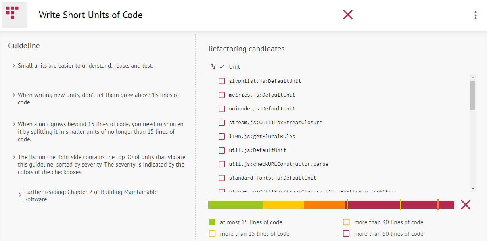
Como podemos ver na linha colorida (mostrada na imagem acima), o PDF.js falha redondamente nesta categoria pela falta de divisão do código. Esta falha dificulta novos contribuidores a compreender o código, bem como a reutilização e testabilidade do código.


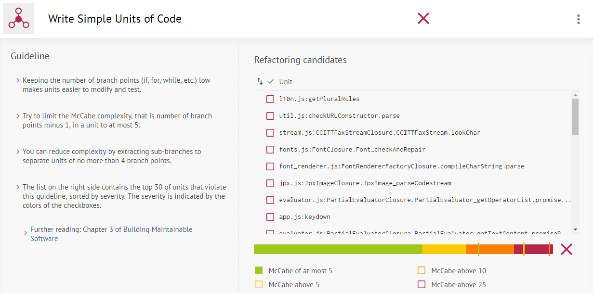
Verifica-se nesta *guideline* um problema semelhante ao anterior: código com demasiada complexidade. Tanto os problemas que advém como as soluções, são semelhantes à *guideline* anterior.


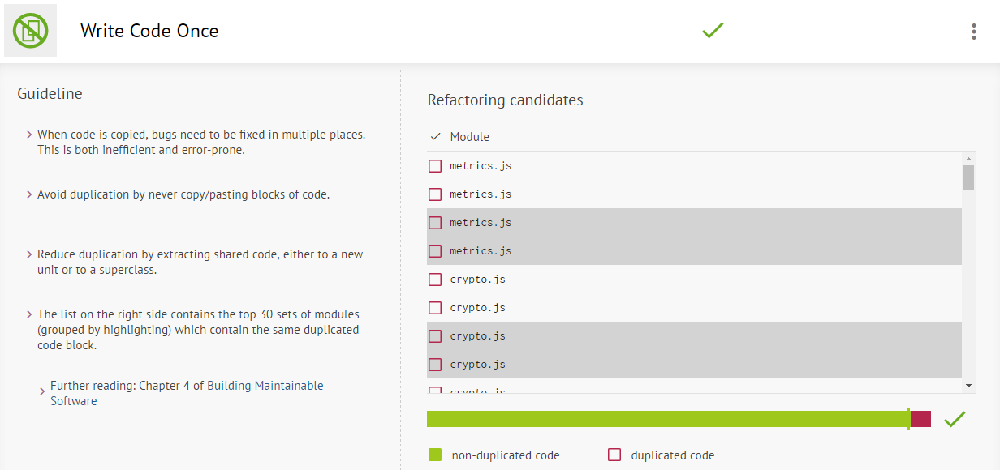
Neste aspeto, o PDF.js não apresenta problemas já que não há muito código duplicado.


Apesar de o código não passar nesta *guideline*, o resultado não é tão mau como em pontos anteriores nem a mudança é tão difícil, pois seria facilmente resolvido com o agrupamento de argumentos num só objeto.


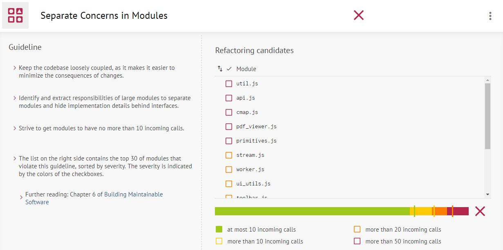
Podemos ver na imagem acima que a separação dos *concerns* dos módulos está perto de ser aceitável, apesar de ainda ter alguns módulos um pouco sobrecarregados.


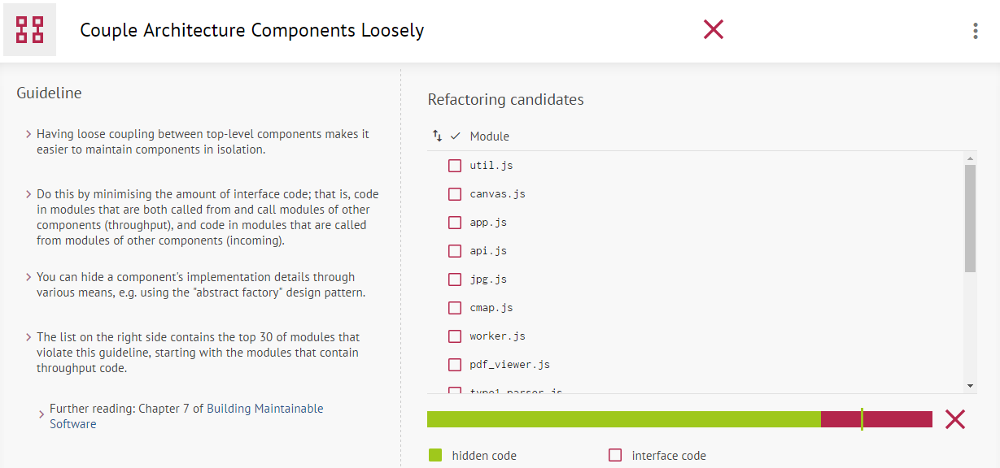
Esta *guideline* tem como propósito analizar a independência dos *components*, algo que podemos concluir que ainda é preciso ser melhorar, de modo a que tornar os próprios *components* mais flexivéis.


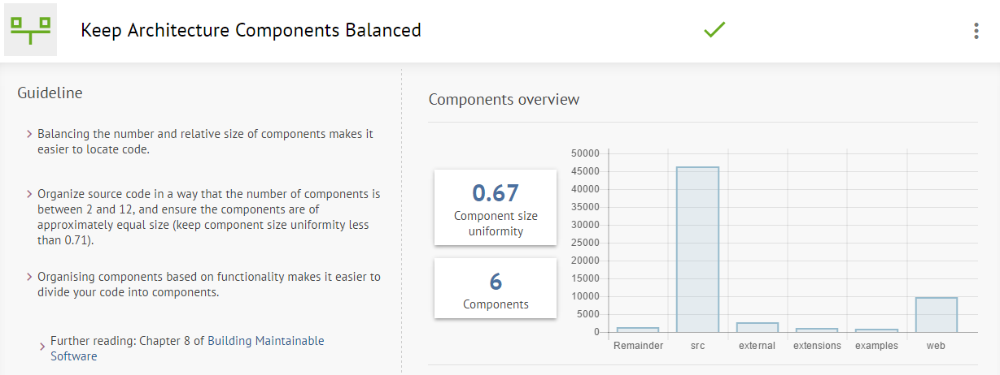
A relação entre os pesos dos *components* está relativamente equilibrada, pois ainda que o *component* *src* esteja bem mais pesado que os restantes, o equílibrio entre estes mesmos restantes é o suficiente para apssar nesta *guideline*.


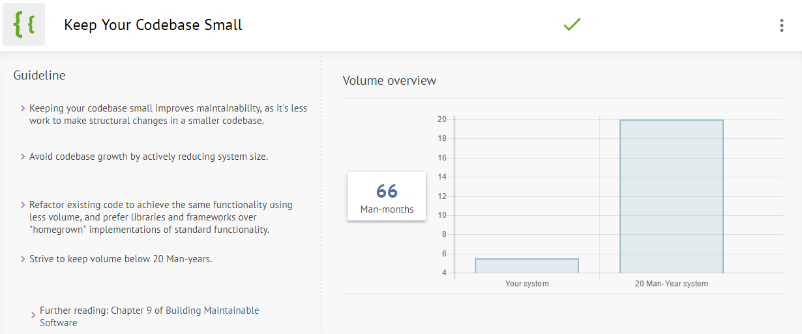
Podemos verificar que o PDF.js passa facilmente nesta *guideline*, o que significa que não terá problemas relativos a manutenção de código.


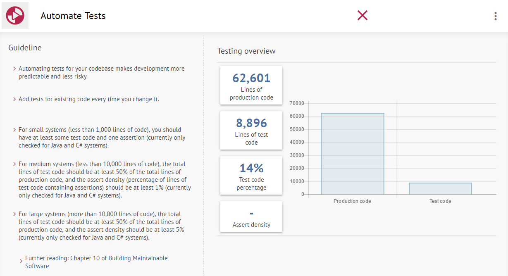
Como já foi visto no relatório anterior a cobertura dos testes deixa um pouco a desejar, consequência dos dados mostrados acima que ilustram que a quantidade de testes deveria ser bem mais elevada (pelo menos para o triplo).


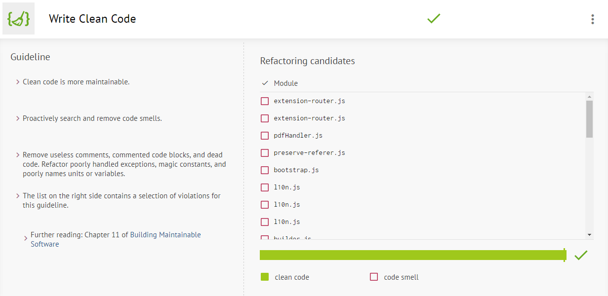
Graças a um cuidado muito apertado por parte da equipa da Mozilla e pela utilização de um [*Style Guide*](https://github.com/mozilla/pdf.js/wiki/Style-Guide), o código consegue manter-se sempre bastante limpo e sem *code smells*.


## Identificação da nova funcionalidade

Apesar de raros, ainda há certos tipos de PDF que o pdf.js é incapaz de ler corretamente. No nosso relatório anterior, corrigimos um *bug* relacionado com a leitura de um formato muito específico de imagens, que se encontrava defeituoso. 

Ao interpretar o código dedicado à interpretação dessas imagens, descobrimos que o pdf.js não está preparado para ler um outro tipo de *bitmaps*, intimamente ligado àquele que era incorretamente renderizado. Este comportamento poderia ser considerado um *bug*, no entanto, é um caso particular que não está em parte alguma previsto pelo pdf.js. Desta forma, consideramo-lo uma adição ao projeto, ou seja, uma *feature*.

### Descrição detalhada da funcionalidade

> "A bilevel image contains two colors—black and white. TIFF allows an application to write out bilevel data in either a white-is-zero or black-is-zero format. The field that records this information is called PhotometricInterpretation."

> *TIFF specification 6.0*

Como tal, a forma como o pdf.js lê um bit depende da tag *PhotmetricInterpretation*, que quando tem o valor igual a 0 dita que um bit a 0 representa a cor branca e que quando tem o valor igual a 1 dita que um bit a 0 tem a cor preta.

O problema com que nos deparámos para implementar esta funcionalidade foi a falta de recursos para testar: não encontrámos nem conseguimos criar nenhuns PDFs com valores de *PhotmetricInterpretation* diferentes. Para implementar a nossa funcionalidade testámo-la invertendo as cores do PDF utilizado para corrigir o *bug*.

Black-is-zero           |  White-is-zero
:-------------------------:|:-------------------------:
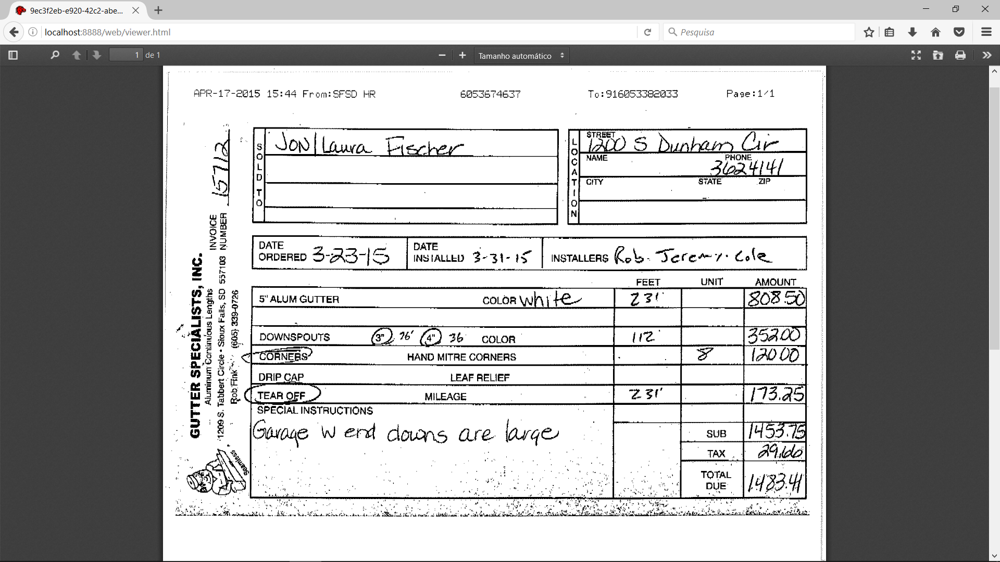  |  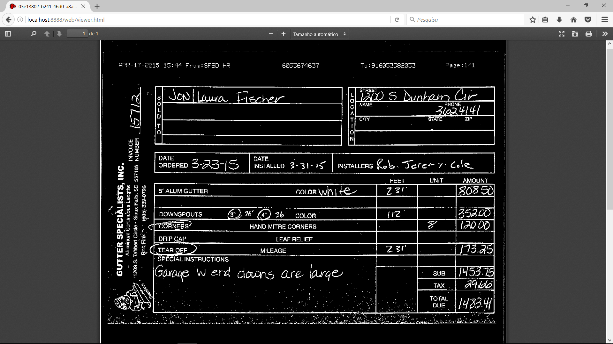

Prevemos que um PDF com *white-is-zero* esteja codificado de forma a que as cores apareçam de forma correta e não invertidas, visto que aquilo que é necessário é apenas alterar a forma como se lê o bit.

### Implementação da funcionalidade

O bloco de código que implementa a *feature* é o mesmo que estudámos para a reparação do *bug*. A alteração que é efetuada altera o valor da variável "complement" de acordo com a tag *PhotometricInterpretation* da imagem TIFF:

```javascript
if (bits === 1) {
   if(PhotometricInterpretation == black-is-zero){
      var complement = 0;
   }
   else{
      var complement = 1;
   }
    var bitOrder = 0;

   for(i=0; i < rowBytes; ++i) {

      inbuf = (inbuf << 8) | (rawBytes[i] & 0xFF);

      for(bitOrder=7; bitOrder>=0; --bitOrder) {
          complement = (complement + (inbuf >> bitOrder)) & 0x1;
          outbuf = (outbuf << 1) | complement;
      }
      buffer[pos++] = (outbuf & 0xFF);
    }
}
```

Este código não está implementado, de momento, ainda não arranjámos forma de obter a *tag* a partir do PDF. No entanto, é ilustrativo do que faremos com esse valor assim que o obtivermos.

## Submissão da funcionalidade

Como a resolução do *bug* e a *feature* estão intimamente ligados, a sua sugestão foi feita no mesmo [*pull request*](https://github.com/mozilla/pdf.js/pull/7869), sendo que estamos em comunicação com a equipa do pdf.js não só através do GitHub, mas também através do seu canal IRC, para discutir melhoramentos em termos de eficiência de processamento e como obter a informação que resta para implementar a funcionalidade.

## Contribuição

Todos os elementos do grupo contribuíram de forma equivalente para a produção deste relatório.

